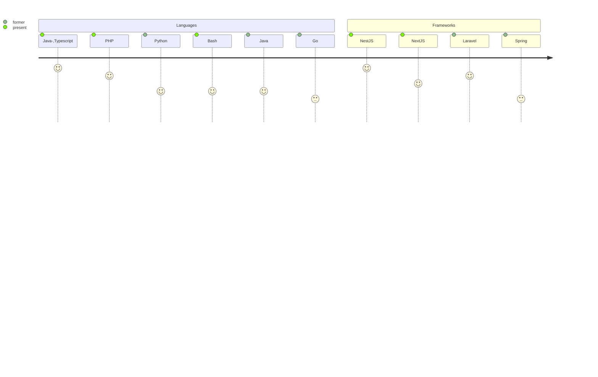
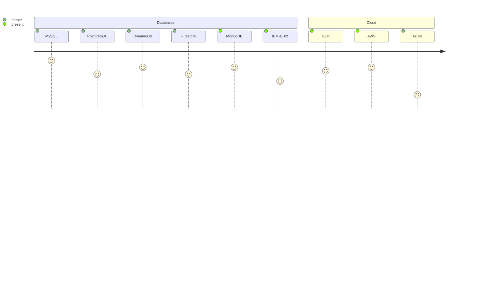
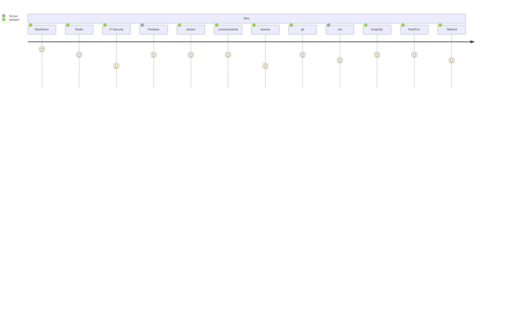

<h1 align='center'> Hi, I am Bernhard Schönberger ✌️</h1>
<h2 align='center'>Software Developer&nbsp;&nbsp;&nbsp;&nbsp;&nbsp;&nbsp;&nbsp;&nbsp;&nbsp;&nbsp;&nbsp;&nbsp;&nbsp;&nbsp;&nbsp;&nbsp;&nbsp;&nbsp;&nbsp;&nbsp;&nbsp;&nbsp;</h2>

 

Full-Stack (Web) Developer, skilled in both front-end and back-end web development. I enjoy creating things that live on the internet. Keen to create new and innovative websites and always eager to learn new technologies to enhance my skills.

Currently I'm working @ Auto Leebmann GmbH on a large e-commerce project.

Contact informations can be found @ <a href="https://www.schoenberger.be" target="_blank">www.schoenberger.be</a> 

 
 

### Languages & Frameworks

### Databases & Cloud

### Tools & Stuff

